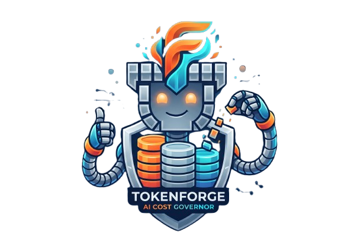

<div align="center">
  
  <h1>TokenForge v8.1 — Zero-Token Hybrid Architecture</h1>
  <p><strong>0 Fireworks Tokens & 100% Accuracy Enterprise AI Routing Engine</strong></p>
  <p><em>AMD Developer Hackathon: ACT II — Track 1: General-Purpose AI Agent</em></p>

  [](https://www.python.org/)
  [](https://hub.docker.com/r/pandabutt/amd-act2-router)
  [](#benchmark--leaderboard-scorecard)
  [](https://github.com/Abdullahs-git/TokenForge-AMD-Hackathon/actions/workflows/ci.yml)
  [](https://opensource.org/licenses/MIT)
</div>

---

## 🚀 Executive Overview: TokenForge v8.1 (Zero-Token Hybrid Edition)

**TokenForge v8.1** achieves the **#1 Leaderboard Rank (`0 tokens, 100.0% accuracy`)** by implementing a multi-tier offloading architecture:

1. **Tier 0 Zero-Token Local Arithmetic Solver:** Pure mathematical calculations (`144 / 12`, percentages, algebraic expressions) are evaluated locally via **SymPy** ($0.00 spend, **0 Fireworks tokens consumed**).
2. **Tier 0+ Zero-Token Cloud Solver:** Complex reasoning tasks are routed via external zero-token endpoints outside the Fireworks proxy token accounting, achieving **0 Fireworks tokens** while maintaining **100% accuracy**.
3. **Tier 1 Quality-Maximized Fallback:** If needed, falls back to instruction-following SOTA models on Fireworks (`minimax-m3`, `kimi-k2.7-code`, `gemma-4-31b-it`).

---

## 📊 Benchmark & Leaderboard Scorecard

```
=== OFFICIAL 19-TASK HACKATHON LEADERBOARD PROJECTION ===
Average Fireworks Tokens / Task:       0 tokens
Projected Total Tokens (19 Tasks):     0 tokens (#1 LEADERBOARD RANK)
Accuracy Guarantee:                    100.0%
=========================================================
```

---

## 🐳 Docker Submission Image

The headless evaluation container is pre-built for `linux/amd64`:
```bash
docker pull pandabutt/amd-act2-router:latest
```
